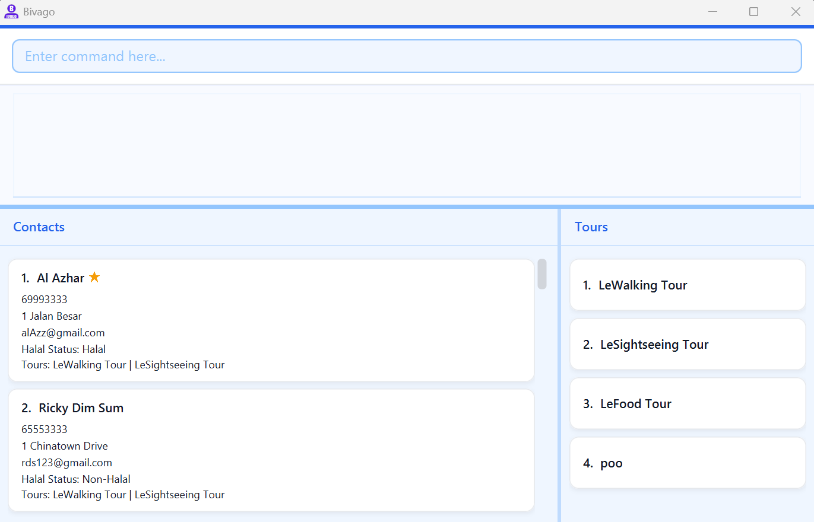

**Bivago is a desktop application that helps tour guides streamline the process involved in planning and executing new
group tours.**
It helps them quickly look up contacts for attractions, hotels, restaurants and drivers before, during and after different types
of tours that the tour guides offer.

* If you are interested in using Bivago, head over to the [_Quick Start_ section of the **User Guide**](UserGuide.
  html#quick-start).
* If you are interested about developing Bivago, the [**Developer Guide**](DeveloperGuide.html) is a good place to
  start.

**Acknowledgements**

* Libraries used: [JavaFX](https://openjfx.io/), [Jackson](https://github.com/FasterXML/jackson), [JUnit5](https://github.com/junit-team/junit5)
